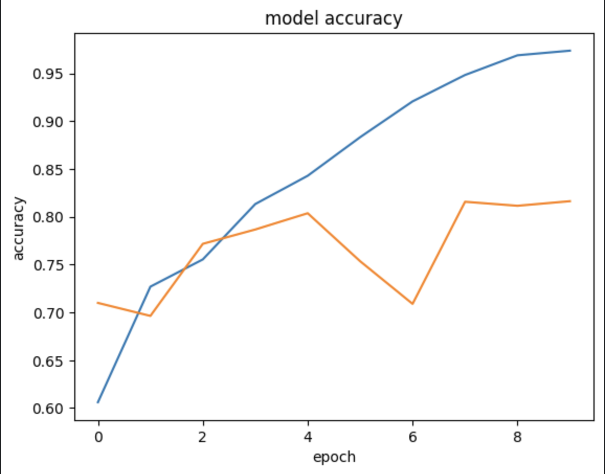
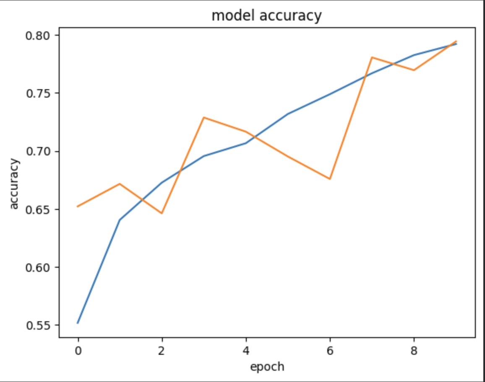

# Cats vs Dogs Classification using LeNet-5 and Data Augmentation

This project implements the classic **LeNet-5 Convolutional Neural Network** for binary image classification on the **Kaggle Dogs vs Cats dataset**. The objective is not only to build an image classifier but also to study the effect of **data augmentation** on model generalization and overfitting.

The project compares two experiments:

- **Experiment 1:** Training LeNet without any data augmentation.
- **Experiment 2:** Training the same architecture with Keras image augmentation techniques.

The comparison highlights how data augmentation improves validation performance while reducing overfitting.

---

## Project Objectives

- Implement the LeNet CNN architecture from scratch using TensorFlow/Keras.
- Train the model on the Kaggle Dogs vs Cats dataset.
- Analyze overfitting behavior.
- Apply image augmentation using Keras.
- Compare training and validation performance of both models.

---

## Dataset

The project uses the **Dogs vs Cats** dataset from Kaggle.

Dataset contains two classes:

- Cat
- Dog

Images are resized to **256 × 256** before training.

Directory structure:
catsvsdogs/
│
├── train/
│ ├── cats/
│ └── dogs/
│
└── test/
├── cats/
└── dogs/


---

## Model Architecture

The implementation follows the classical **LeNet-5** style architecture.

```
Input Image (256×256×3)
        │
Conv2D
        │
ReLU
        │
Average/Max Pooling
        │
Conv2D
        │
ReLU
        │
Pooling
        │
Flatten
        │
Dense
        │
Dense
        │
Sigmoid
```

---

## Experiment 1: Training without Data Augmentation

The first experiment trains LeNet directly on the original training images.

### Observation

- Training accuracy continuously increases.
- Validation accuracy plateaus much earlier.
- Large gap between training and validation accuracy.
- Indicates **overfitting**.

### Results

| Metric | Value |
|---------|------:|
| Training Accuracy | ~97% |
| Validation Accuracy | ~81% |

Training Accuracy:

<p align="center">

</p>

---

## Experiment 2: Training with Data Augmentation

The second experiment applies random transformations during training.

Augmentation techniques include:

- Random horizontal flip
- Random rotation
- Random zoom
- Random translation
- Random contrast adjustment

These transformations generate new image variations every epoch, allowing the model to learn more robust and invariant features.

### Observation

- Validation accuracy closely follows training accuracy.
- Overfitting is significantly reduced.
- Better generalization on unseen images.

### Results

| Metric | Value |
|---------|------:|
| Training Accuracy | ~79% |
| Validation Accuracy | ~79% |

Training Accuracy:

<p align="center">

</p>

---

# Comparison

| Without Augmentation | With Augmentation |
|----------------------|-------------------|
| Training accuracy increases rapidly | Slower but more stable learning |
| Large train-validation gap | Train and validation curves remain close |
| Clear overfitting | Better generalization |
| Model memorizes training images | Model learns invariant visual features |

---

## Why Data Augmentation Helps

Instead of memorizing the exact training images, the model is exposed to different transformed versions during every epoch.

Examples of transformations:

- Horizontal Flip
- Rotation
- Zoom
- Translation
- Contrast Adjustment

This effectively creates an almost infinite number of unique training samples without permanently storing additional images.

As a result, the network learns more robust visual features that generalize better to unseen data.

---

## Technologies Used

- Python
- TensorFlow
- Keras
- NumPy
- Matplotlib
- Google Colab

---

## Results Summary

The experiment demonstrates an important deep learning principle:

> **Higher training accuracy does not necessarily imply a better model.**

Although the model without augmentation achieves nearly **97% training accuracy**, its validation performance stagnates due to overfitting.

After introducing data augmentation, the training accuracy decreases, but the validation accuracy becomes significantly more stable and closely matches the training accuracy, indicating improved generalization.

---

## Future Improvements

- Transfer Learning (ResNet50, EfficientNet)
- Early Stopping
- Learning Rate Scheduling
- Dropout and L2 Regularization
- Hyperparameter Optimization

---

## Repository Structure

```
.
├── notebook
│   ├── LeNet_and_data_augmentation.ipynb
├── README.md
├── results
│   ├── no_augmentation.png
│   └── augmentation.png
```

---

## Author

**Abhigyan Tripathi**
